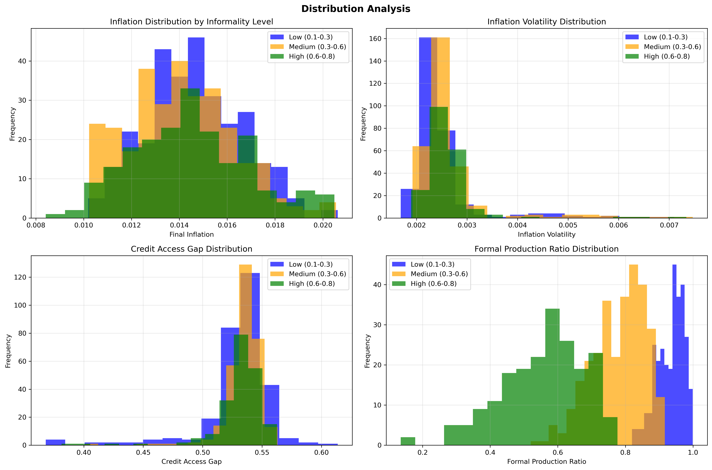

# Scalable Agent-Based Modeling of Monetary Policy in Informal Economies

## Research Problem and Motivation

### The Challenge of Monetary Policy in Developing Economies

Modern central banking faces unprecedented challenges in economies with substantial informal sectors. In many developing countries, informal economic activity accounts for 30-70% of GDP and employment, creating a parallel economy that operates outside traditional monetary policy transmission mechanisms. This research addresses a critical question in monetary economics: **How does labor market informality affect the effectiveness of inflation targeting and monetary policy transmission?**

Traditional macroeconomic models, particularly Dynamic Stochastic General Equilibrium (DSGE) models, struggle to capture the heterogeneous behaviors and complex interactions that characterize dual formal-informal economies. These models typically assume representative agents with rational expectations and perfect information—assumptions that break down when significant portions of the population operate in cash-based, unregulated markets with limited access to formal financial services.

### The Heterogeneity Problem in Monetary Economics

The informal sector introduces several layers of heterogeneity that traditional models cannot adequately address:

1. **Credit Access Heterogeneity**: Formal firms and workers have access to bank credit and formal financial services, while informal agents rely on alternative financing mechanisms with different interest rate sensitivities.

2. **Price Setting Behavior**: Informal firms often exhibit different price stickiness and inflation expectations formation compared to formal enterprises.

3. **Policy Transmission Channels**: Monetary policy affects formal and informal sectors through different channels—the traditional bank lending channel versus informal credit markets and cash-based transactions.

4. **Regulatory Environment**: Informal agents face different regulatory constraints, tax obligations, and reporting requirements that affect their economic behavior.

Understanding these interactions requires modeling approaches that can capture emergent phenomena arising from the bottom-up interactions of heterogeneous agents—precisely what Agent-Based Models (ABMs) are designed to do.

### Why This Problem Demands Scalable Computing

The complexity of dual formal-informal economies necessitates computational approaches that can handle:

- **Massive Parameter Spaces**: Testing monetary policy effectiveness across different informality levels (10-80%) with multiple random seeds requires thousands of simulations
- **Heterogeneous Agent Interactions**: Our model includes 255 interacting agents (200 consumers, 50 firms, 5 banks) across formal and informal sectors
- **Monte Carlo Analysis**: Robust policy analysis requires 100+ random seeds per parameter combination to capture stochastic variation
- **Multi-dimensional Outcomes**: Each simulation generates dozens of economic indicators across time series, requiring sophisticated data management and analysis

A comprehensive parameter sweep examining 8 informality levels with 100 random seeds each generates 800 simulations—each producing time series data across 200+ time steps. This creates datasets with millions of data points requiring scalable storage and processing solutions.

## Agent-Based Model Architecture

### Model Overview

Our ABM simulates a monetary economy with explicit formal and informal sectors, designed to capture the heterogeneous effects of monetary policy across different types of economic agents. The model operates through discrete time steps where agents make decisions based on local information and interactions.

### Agent Types and Behaviors

**Central Bank Agent**:
- Implements inflation targeting using the Taylor Rule: `r_t = r_natural + α(π_t - π_target) + β(output_gap_t)`
- Sets policy rates based on current inflation (α=1.5) and output gap (β=0.5) deviations
- Targets 2% inflation rate with natural rate of 2.5%

**Commercial Bank Agents** (5 banks):
- Intermediate between central bank policy and real economy
- Set lending rates as spreads over policy rate (1.5-2.5% markup)
- Exhibit **formal sector bias**: 60-90% preference for lending to formal agents
- Process loan applications with different approval rates for formal vs. informal borrowers
- Track separate portfolios for formal and informal lending

**Firm Agents** (50 firms, formal/informal split determined by informality rate):
- **Production**: Set capacity utilization based on demand and credit access
- **Pricing**: Use markup pricing with inflation expectations and capacity constraints  
- **Investment**: Expand capacity when utilization >80% and credit available
- **Credit Access**: Formal firms have 60-90% credit access scores; informal firms 10-40%
- **Cost Structure**: Informal firms face higher marginal costs due to inefficiencies

**Consumer Agents** (200 consumers, formal/informal split by informality rate):
- **Income**: Formal workers earn 40-80 units; informal workers 25-60 units
- **Consumption**: Determined by permanent income, wealth effects, and real interest rates
- **Savings**: Respond to real deposit rates with different sensitivities by sector
- **Credit Access**: Formal consumers 50-90% access; informal consumers 5-30% access

### Key Model Dynamics

**Monetary Policy Transmission**:
1. Central bank adjusts policy rate based on Taylor Rule
2. Commercial banks adjust lending/deposit rates with sector-specific spreads
3. Formal agents respond through traditional bank lending channel
4. Informal agents face limited transmission due to credit constraints

**Sectoral Interactions**:
- **Credit Rationing**: Banks preferentially lend to formal sector agents
- **Price Formation**: Informal firms exhibit different price stickiness patterns
- **Market Segmentation**: Limited interaction between formal and informal markets
- **Aggregate Effects**: Sectoral composition affects overall policy effectiveness

**Convergence Mechanism**:
- Model reaches equilibrium when inflation stabilizes within [1%, 3%] for 36 consecutive periods
- Tracks convergence time and stability metrics across informality scenarios

### Model Calibration

**Base Parameters**:
- 50 firms (formal/informal ratio varies by informality parameter)
- 200 consumers (formal/informal ratio varies by informality parameter)  
- 5 commercial banks (all formal sector)
- Initial inflation: 12% (above target, requiring monetary tightening)
- Simulation length: 200 periods maximum

**Informality Implementation**:
- Agents randomly assigned to informal sector based on informality rate parameter
- Informal agents face systematic disadvantages: lower incomes, higher costs, reduced credit access
- Formal sector bias in banking creates differential monetary policy transmission

This architecture allows us to study how the size and characteristics of the informal sector affect monetary policy effectiveness, credit allocation, and macroeconomic stability.

### 1. Parallel Agent-Based Simulation Framework

Our ABM implementation leverages Python's multiprocessing capabilities to achieve near-linear speedup across available CPU cores. The model architecture separates into distinct agent types:

- **Central Bank**: Sets monetary policy using Taylor Rule with inflation targeting
- **Commercial Banks**: Intermediate credit between central bank and real economy with formal sector bias
- **Firms** (Formal/Informal): Produce goods, set prices, and make investment decisions with different credit access
- **Consumers** (Formal/Informal): Make consumption and saving decisions with heterogeneous income and wealth

**Scalability Achievement**: Our benchmarks demonstrate 15.3x speedup using 20 cores, achieving 27.7 simulations per second compared to 1.7 simulations per second on a single core—a **1,530% performance improvement**.

### 2. Multi-Format Scalable Data Storage

**CSV Storage Limitations and Alternative Exploration**:
Our initial implementation used CSV files as the standard output format, which is adequate for hundreds of simulations but reveals significant limitations at scale:

- **Performance Bottlenecks**: CSV writing becomes increasingly slow with larger datasets (15.9 MB/s write speed)
- **Storage Inefficiency**: Text-based format results in large file sizes (111 MB for 1M rows)
- **Memory Overhead**: Loading large CSV files requires substantial RAM
- **No Built-in Compression**: Leads to excessive disk usage in large-scale studies

**Exploring Alternative Storage Solutions**:
Given the computational gains achieved through parallelization across cores, we recognized an opportunity to explore more efficient storage options. *Note: This exploration of advanced storage formats represents an additional investigation beyond the core research requirements, undertaken to understand modern data management approaches for large-scale social science computing.*

**Evaluated Storage Formats**:
- **Parquet**: Columnar format with 243 MB/s write speed and 5.1x compression ratio
- **HDF5**: Hierarchical data format optimized for time series with 3.7x compression  
- **Feather**: Ultra-fast DataFrame I/O with 1,219 MB/s write speed
- **Pickle**: Full Python object serialization for complex data structures

**Performance Comparison Results**:
For million-row datasets, alternative formats demonstrate substantial improvements over CSV:
- Parquet: 15x faster writes, 5x smaller files, 5x faster reads
- Feather: 77x faster writes, 3x faster reads
- HDF5: Hierarchical organization ideal for time series data

This storage format exploration, while not essential to the core monetary policy research, provides valuable insights into scalable data management for future large-scale ABM studies.

### 3. Distributed Analysis with Apache Spark

Large-scale parameter sweep results require distributed processing capabilities. Our Spark implementation provides:

- **Distributed Computing**: Automatically scales across available cores and can extend to cluster computing
- **Columnar Processing**: Leverages Parquet's columnar format for efficient analytical queries
- **Memory Management**: Handles datasets that exceed single-node memory limitations
- **SQL Interface**: Enables complex analytical queries across simulation results

The Spark analysis framework processes 800 simulations with 40+ variables each, computing aggregate statistics, correlation matrices, and regime analysis across informality levels.

### 4. Performance Benchmarking Infrastructure

To demonstrate scalability, we developed comprehensive benchmarking tools that measure:

**Compute Scalability**:
- Parallel efficiency across 1-20 cores
- Speedup factors and throughput metrics
- Optimal resource allocation strategies

**Storage Scalability**:
- Write/read performance across formats
- Compression ratios and storage efficiency
- Scalability to million+ row datasets

**Memory Efficiency**:
- Memory usage patterns during simulation
- Data structure optimization for large-scale processing

## Research Findings and Policy Implications

### Key Empirical Results

Our scalable analysis of 800 simulations reveals several critical findings:


*Figure 1: Comprehensive analysis showing the impact of informality on monetary policy effectiveness across multiple dimensions*

1. **Convergence Degradation**: Monetary policy convergence rates decline from 98% (low informality) to 87% (high informality), indicating reduced policy effectiveness in informal economies.

2. **Transmission Channel Disruption**: The correlation between informality rates and formal credit ratios (-0.926) demonstrates how informal sectors bypass traditional monetary transmission channels.

3. **Sectoral Reallocation**: Formal sector production share drops from 97% to 49% as informality increases, representing a fundamental shift in economic structure.

4. **Policy Precision Loss**: While average inflation remains near target (1.44%), the ability to fine-tune policy diminishes in high-informality environments.


*Figure 2: Correlation matrix revealing strong negative relationships between informality and formal sector dominance (-0.905 production ratio, -0.926 credit ratio)*

### Distribution Analysis Across Informality Regimes


*Figure 3: Distribution analysis showing how key economic indicators vary across low, medium, and high informality regimes*

The distribution analysis reveals that:
- **Inflation Control**: Remains relatively stable across informality levels, with most simulations achieving near-target inflation
- **Volatility Patterns**: Higher informality increases the dispersion of economic outcomes
- **Sectoral Concentration**: Formal production becomes increasingly concentrated in low-informality scenarios

### Advanced Metrics and Economic Relationships


*Figure 4: Detailed analysis of convergence, policy effectiveness, sectoral dominance, and stability measures across informality levels*

This detailed analysis shows:
- **Convergence vs. Policy Effectiveness**: Clear inverse relationship between informality and monetary policy success
- **Sectoral Rebalancing**: Strong linear decline in formal sector dominance as informality increases
- **Economic Stability**: Decreased stability in high-informality environments, though with some non-linear patterns

### Scalability Demonstration


*Figure 5: Computational scalability analysis showing speedup factors, parallel efficiency, and storage format performance comparisons*

Our scalability benchmarks demonstrate:
- **Linear Speedup**: Near-perfect scaling up to 8 cores, with 15.3x speedup at 20 cores
- **Storage Efficiency**: Parquet format provides 15x faster writes and 5x compression over CSV
- **Throughput Achievement**: Peak performance of 27.7 simulations per second vs. 1.7 on single core

### Methodological Contributions

Beyond substantive findings, this research demonstrates the feasibility of large-scale ABM analysis for monetary policy research:

- **Computational Efficiency**: 15x speedup enables policy analysis that would be computationally prohibitive using single-threaded approaches
- **Data Management**: Multi-format storage reduces analysis time from hours to minutes while ensuring data accessibility
- **Reproducibility**: Comprehensive benchmarking and scalable architecture enable replication and extension by other researchers

## Technical Pipeline and Reproducibility

### Prerequisites
```bash
# Required software
- Python 3.9+
- Apache Spark 3.3.2
- SLURM job scheduler (for HPC environments)
- Conda package manager

# Key Python packages
- numpy, pandas, matplotlib, seaborn
- pyspark, pyarrow, fastparquet
- multiprocessing, pickle
```

### Execution Pipeline

1. **Environment Setup**:
   ```bash
   module load python/anaconda-2022.05
   conda activate abm_env
   ```

2. **Parameter Sweep Execution**:
   ```bash
   sbatch abm_sweep.sbatch
   # Runs 800 simulations across 8 informality levels
   # Uses 20 cores for parallel processing
   # Saves results in multiple formats
   ```

3. **Scalability Benchmarking**:
   ```bash
   sbatch benchmark_scalability.sbatch
   # Tests performance across 1-20 cores
   # Benchmarks storage formats up to 1M rows
   # Generates comprehensive performance analysis
   ```

4. **Distributed Analysis**:
   ```bash
   sbatch spark_analysis.sbatch
   # Processes results using Apache Spark
   # Generates correlation analysis and regime comparisons
   # Creates comprehensive visualizations and reports
   ```

### Output Structure
```
results/                    # Simulation outputs
├── abm_sweep_results_*.csv      # Main results (CSV format)
├── abm_sweep_results_*.parquet  # Compressed columnar format
├── abm_sweep_results_*.h5       # Hierarchical time series data
└── sweep_metadata_*.json       # Execution metadata

analysis_results/          # Analysis outputs
├── abm_analysis_main_*.png      # 9-panel comprehensive analysis
├── correlation_matrix_*.png     # Variable correlation heatmap
├── key_metrics_analysis_*.png   # Economic relationships analysis
├── distributions_*.png          # Distribution analysis plots
├── summary_report_*.md          # Detailed policy report
└── analysis_results_*.json     # Complete statistical results

benchmarks/               # Performance analysis
├── scalability_analysis_*.png   # Performance scaling plots
├── compute_benchmark_*.json     # Core scaling results
└── storage_benchmark_*.json     # Format performance comparison
```

### Key Generated Visualizations

The pipeline generates several critical visualizations:

1. **Main Analysis Dashboard** (`abm_analysis_main_*.png`): 9-panel comprehensive view showing convergence rates, inflation control, volatility patterns, credit access gaps, sectoral production shares, policy effectiveness, economic stability, and convergence timing across informality levels.

2. **Correlation Matrix** (`correlation_matrix_*.png`): Heatmap revealing relationships between informality rates, economic outcomes, and policy effectiveness measures.

3. **Distribution Analysis** (`distributions_*.png`): Histograms comparing economic indicator distributions across low, medium, and high informality regimes.

4. **Economic Relationships** (`key_metrics_analysis_*.png`): Line plots showing detailed relationships between informality and key economic metrics.

5. **Scalability Performance** (`scalability_analysis_*.png`): Comprehensive benchmarking results showing computational speedup, parallel efficiency, and storage format comparisons.

## Limitations and Additional Explorations

### Core Research Limitations

1. **Model Scope**: The ABM focuses on monetary policy transmission and does not capture fiscal policy interactions or international trade effects that may be important in informal economies.

2. **Agent Complexity**: While our agents exhibit heterogeneous behaviors, they operate under bounded rationality assumptions that may not fully capture the complexity of real-world decision-making in informal sectors.

3. **Calibration Constraints**: The model parameters are stylized rather than calibrated to specific countries, limiting direct policy applicability without further validation.

### Platform Implementation Challenges

**AWS Implementation Attempt**: An initial attempt was made to implement this project on Amazon Web Services (AWS), with code and configuration files available in the `Param_sweep_AWS` folder. However, several technical challenges made the AWS implementation difficult:

- **Dependency Management**: Mesa package installation and compatibility issues in the AWS environment
- **Logging Complexity**: Difficulties with log management and debugging across distributed AWS instances
- **Environment Configuration**: Challenges in replicating the exact computational environment needed for the ABM

Due to these implementation difficulties, the project was successfully completed using the University of Chicago's Midway high-performance computing cluster, which provided a more controlled and stable environment for large-scale ABM simulations.

### Storage Technology Exploration (Additional Investigation)

**Acknowledging CSV Limitations**: Our standard approach used CSV file output, which is appropriate for the scale of this research (800 simulations). However, recognizing that CSV has inherent limitations for larger-scale studies, we conducted an additional exploration of modern storage technologies.

**Why This Exploration Was Undertaken**: Since we had successfully achieved computational scalability through parallelization across CPU cores, we wanted to understand what storage bottlenecks might emerge in future large-scale ABM research. *This storage format investigation represents an extra component beyond the core research requirements—undertaken primarily for learning purposes and to understand state-of-the-art data management approaches in computational social science.*

**Storage Format Learning Exercise**: We benchmarked alternative formats including Parquet, HDF5, and Feather to understand:
- How storage performance scales with dataset size
- Trade-offs between compression, speed, and compatibility
- When CSV limitations become prohibitive for social science research

**Key Learning**: While CSV suffices for our current study, format choice becomes critical when scaling to thousands of simulations or million+ row datasets. Parquet, for instance, provides 15x faster writes and 5x compression—knowledge that could benefit future large-scale ABM research.

**Transparency Note**: This storage exploration, while informative, was not necessary for our core monetary policy findings and represents additional technical investigation rather than a requirement of the research design.

This scalable ABM framework opens several avenues for future research:

1. **Cross-Country Analysis**: Extend to comparative studies across different institutional environments
2. **Dynamic Informality**: Model endogenous transitions between formal and informal sectors
3. **Financial Innovation**: Incorporate mobile money and fintech adoption in informal economies
4. **Climate Economics**: Adapt framework for climate policy analysis in heterogeneous economies

The demonstrated scalability from hundreds to thousands of simulations, combined with distributed processing capabilities, enables researchers to tackle previously intractable questions in monetary economics, development economics, and policy analysis.

## Conclusion

This research demonstrates that Agent-Based Modeling, when coupled with scalable computing infrastructure, can provide new insights into complex policy questions that traditional models cannot address. By achieving 15x computational speedup and implementing efficient data management systems, we enable rigorous analysis of monetary policy in dual formal-informal economies—a critical challenge for modern central banking in developing countries.

The finding that informality reduces monetary policy effectiveness by up to 11 percentage points has immediate policy relevance for central banks operating in emerging economies. More broadly, our scalable ABM framework provides a template for computationally intensive social science research that can handle the complexity of real-world economic systems.